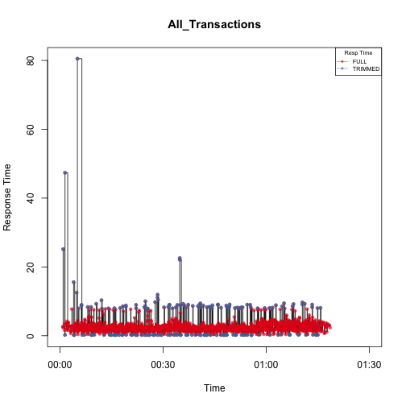

Load Test Analysis Tool
========================================================
author: Stephen O'Connell
date: 8/23/2014

Background
========================================================

The Load test Analysis Tool

- Business applications need to be load tested prior to deployment in production supporting the business users
- Each application has non-functional requirements (NFR) for performance, most are for response time
- A load test simulates the major business functions and collects metrics on the application response times
- The pass/fail criteria is 90% of all transactions must complete with in the NFR, with less than 5% errors.
- The Load Test Analysis Tool analyzes the detail of these test results

Functions
========================================================

* Data import *
* Report the raw data and summary stats for the tests
* Trim outliers from the raw data
* Generate diagnostic plots for each transaction:
    + Distribution of all data
    + Distribution of trimmed data
    + Time series of when the transactions occurred during the test, highlighting the "trimmed" data points.
    + Transaction per sample period.

<small>Note: : DUE TO COMPLICATIONS WITH RUNNING ON A SHARED SERVER I ELECTED TO USE ONE DATASET IMBEDED IN THE CODE. </small>

Raw Data
========================================================
The Raw Data is collected from each load test

The data has the following format:

1. row_num: a sequence number
2. scenario_elasped_time: the time in the test when the transaction started.
3. trans_resp_time:  the duration of the transaction
4. trans_name: the name of the transaction

Summary
========================================================

A statistical summary is provided for each transaction:

- Compares the full data to the trimmed data
- Can be filtered by the transaction name
- The summaries can be sorted by each statistic

Transaction
========================================================
Plots like the following are provided

  
